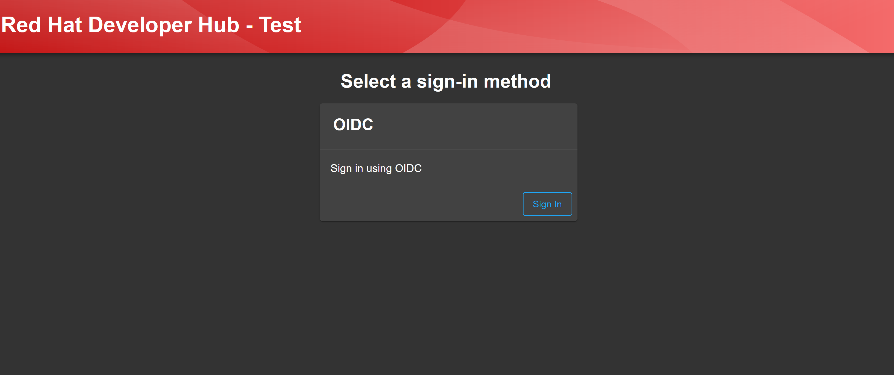
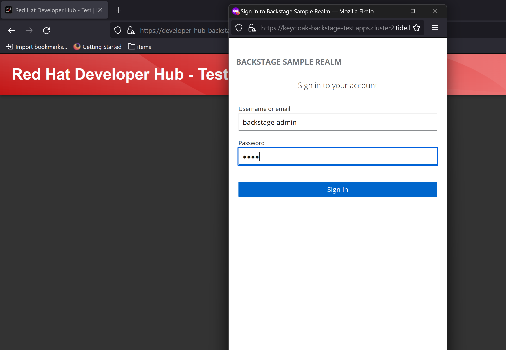
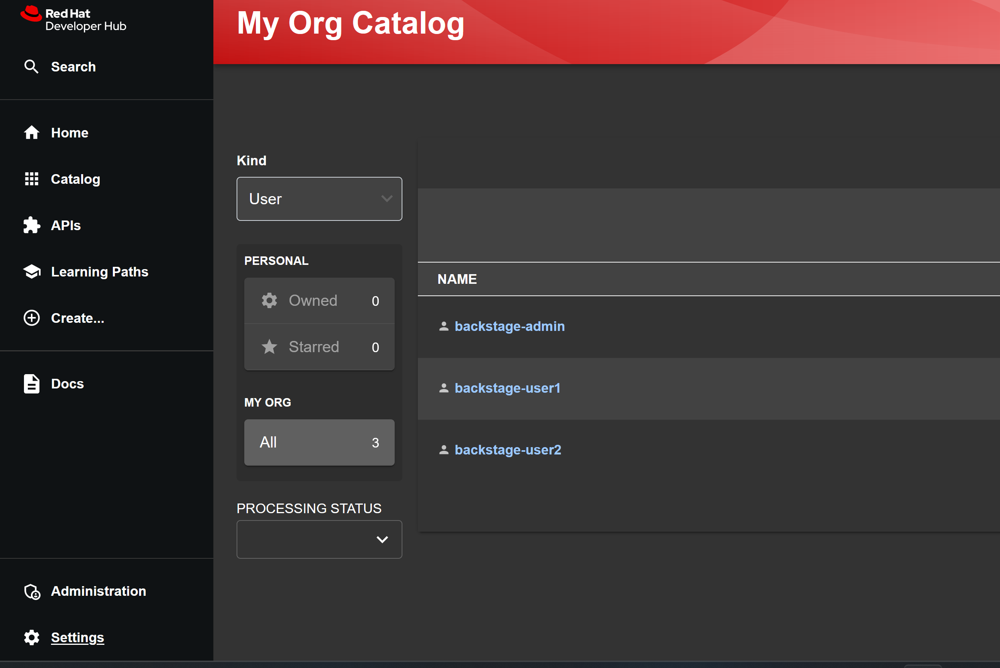
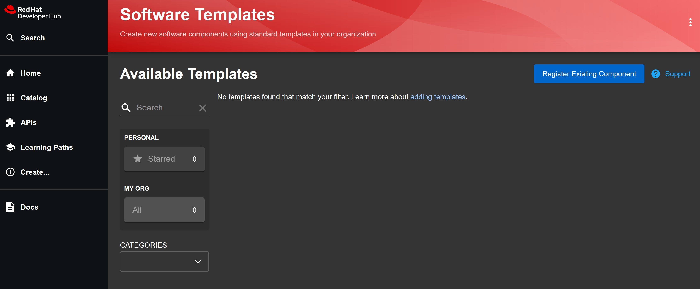
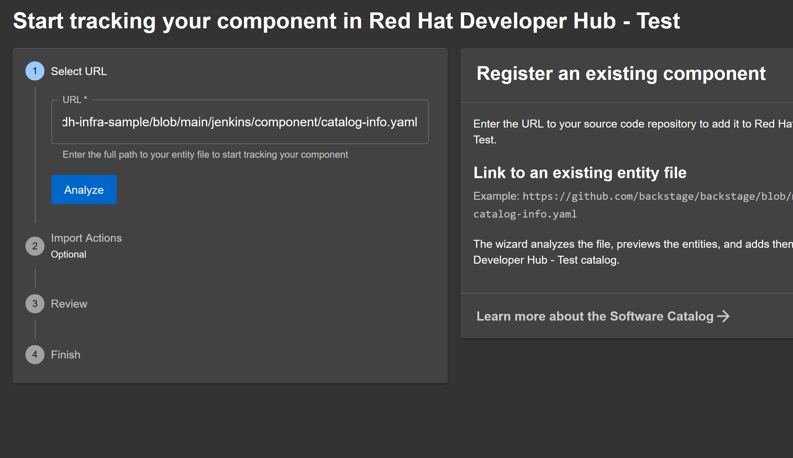
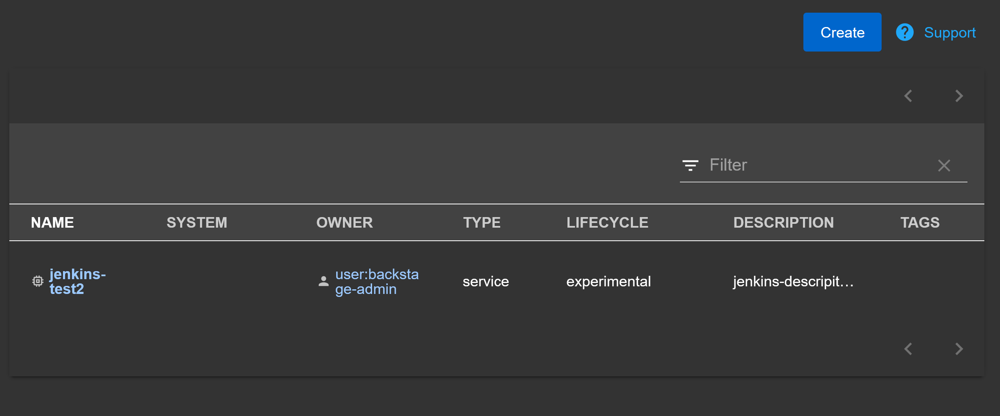
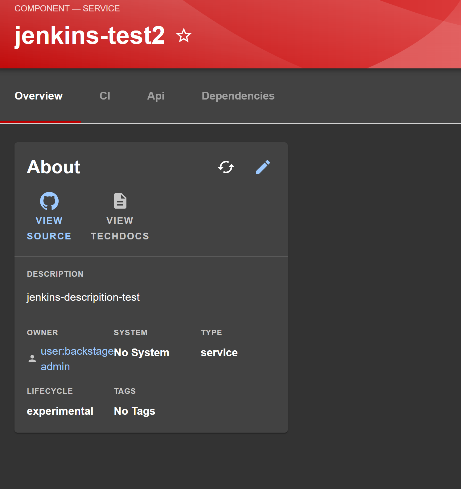
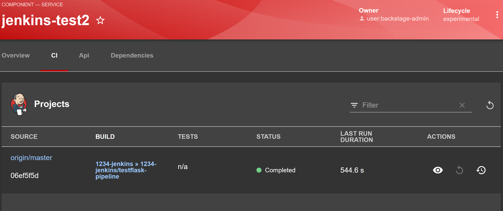

# RHDH Infra Samples

This repository provides sample files and instructions to play with Red Hat Developer Hub(Backstage) and different types of Infrastructure integrations. it's open to contributions


## Sample 1 - Authentication with Red Hat SSO(keycloak) via OIDC
The below sample will:   
  - Create a project in OCP  
  - Install Red Hat SSO for OIDC authentication
  - Create a Red Hat SSO Instance Instance,Realm and 3 Users(backstage-admin,backstage-user1,backstage-user2) with a default password of "test"
  - Install Red Hat Developer Hub via Helm  
  - Give backstage-admin user the admin role, backstage-user1 the catalog-admin role and backstage-user2 is a standard user.

### Requirements
  - OCP Cluster => 4.12
  - oc command line tool
  - Helm 3.2.0 or later is installed.
  - PersistentVolume provisioner support in the underlying infrastructure is available.
  - Tested with version 1.1.0 of  openshift-helm-charts/redhat-developer-hub
  - [yq](https://github.com/mikefarah/yq/releases) > 4
  - Dependecies of the RHDH Helm Chart can change. Please review below for other dependencies.
     ```bash
    helm show readme --version 1.1.0 openshift-helm-charts/redhat-developer-hub
    ```


### Installation

Follow the steps below to install Keycloak and Red Hat Developer Hub:

### Steps
  - Set Variables  
      
      Set Namespace to create resources In
      ```bash
      export RHDH_OPERATOR_NAMESPACE=rhdh-operator
      export SSO_NAMESPACE=rhsso-operator
      export NAMESPACE=backstage-test
      ```

      Set the Basedomain for OCP routes
      ```bash
      export BASEDOMAIN=$(oc get ingresses.config.openshift.io/cluster -o jsonpath='{.spec.domain}')
      ```
      
      Set a secret for SSO Client
      ```bash
      export BACKSTAGE_CLIENT_SECRET=$(cat /dev/urandom | base64 | tr -dc 'a-zA-Z0-9' | fold -w 32 | head -n 1)
      ```

      Set an Auth Session Secret
      ```bash
      export AUTH_SESSION_SECRET=$(cat /dev/urandom | tr -dc 'a-zA-Z0-9' | fold -w 32 | head -n 1)
      ```

      Set Keycloak Base URL
      ```bash
      export KEYCLOAK_BASE_URL=https://keycloak-${SSO_NAMESPACE}.${BASEDOMAIN}
      ```

      Set Keycloak Realm Name
      ```bash
      export KEYCLOAK_REALM=backstage
      ```

      Set Backstage CR Name  
      ```
      export BACKSTAGE_CR_NAME=backstage-test
      ```

  - Create our namespaces
      ```bash
      oc kustomize ./namespace | envsubst | oc apply -f -
      ```

  - Install the Red Hat SSO Operator
      ```bash
      oc kustomize ./sso-operator/ | envsubst | oc apply -f -
      ```

  - Create the Red Hat SSO Instance,Realm,Client and User. This will create 3 users admin,user1,user2 all with a password set to the value "test".  Will also wait for Keycloak Instance to be Ready(Can copy all).
    ```bash
    
    csv=$(oc get subscriptions.operators.coreos.com/rhsso-operator -n ${SSO_NAMESPACE} -o jsonpath='{.status.installedCSV}');

    while [ -z $csv ];do
    echo -e "Operator Not Yet Installed\n"
    sleep 5
    csv=$(oc get subscriptions.operators.coreos.com/rhsso-operator -n ${SSO_NAMESPACE} -o jsonpath='{.status.installedCSV}');   
    done
  
    oc wait --for=jsonpath='{.status.phase}'=Succeeded ClusterServiceVersion/$csv --allow-missing-template-keys=true --timeout=150s -n $SSO_NAMESPACE;

    oc kustomize ./sso-manifests | envsubst | oc apply -f -
    
    until [ $(curl -k -s -o /dev/null -I -w "%{http_code}" ${KEYCLOAK_BASE_URL}/auth/realms/${KEYCLOAK_REALM}/.well-known/openid-configuration) -eq "200" ];do echo -e "Waiting for Keycloak instance endpoint to become ready at ${KEYCLOAK_BASE_URL}/auth/realms/${KEYCLOAK_REALM}/.well-known/openid-configuration \n" && sleep 10;done
  
    oc wait --for=jsonpath='{.status.ready}'=true --allow-missing-template-keys=true --timeout=120s Keycloak/backstage -n $SSO_NAMESPACE
    ```

  - Create RHDH Operator with Kubernetes/Topology component integration and Keycloak integration

    ```bash
    export BACKSTAGE_SA=backstage-sa
    oc create sa ${BACKSTAGE_SA} -n ${NAMESPACE}

    BACKSTAGE_TOKEN_SECRET=$(oc describe sa/${BACKSTAGE_SA} -n ${NAMESPACE} | grep Tokens | head -n 1 | cut -d ":" -f2 | tr -d " ")

    export BACKSTAGE_SA_TOKEN=$(oc get secret ${BACKSTAGE_TOKEN_SECRET} -o=jsonpath={.data.token} -n ${NAMESPACE} | base64 -d)
    export OCP_API_SERVER=$(oc whoami --show-server)

    export CLUSTER_NAME="cluster-main"

    oc kustomize ./rhdh-manifests/rhdh-config | envsubst '${BACKSTAGE_CR_NAME} ${NAMESPACE} ${BASEDOMAIN}' | oc apply -n ${NAMESPACE} -f -

    oc kustomize ./rhdh-manifests/rhdh-kube-setup/ | envsubst |  oc apply -f -

    oc kustomize ./rhdh-manifests/rhdh-operator/ | envsubst |  oc apply -f -
 
    sleep 10

    csv=$(oc get subscriptions.operators.coreos.com/rhdh -n ${RHDH_OPERATOR_NAMESPACE} -o jsonpath='{.status.installedCSV}');

    while [ -z $csv ];do
    echo -e "Operator Not Yet Installed\n"
    sleep 5
    csv=$(oc get subscriptions.operators.coreos.com/rhdh -n ${RHDH_OPERATOR_NAMESPACE} -o jsonpath='{.status.installedCSV}'); 
    done

    oc wait --for=jsonpath='{.status.phase}'=Succeeded ClusterServiceVersion/$csv --allow-missing-template-keys=true --timeout=150s -n ${RHDH_OPERATOR_NAMESPACE};

    oc kustomize ./rhdh-manifests/rhdh-cr | envsubst |  oc apply -f -

    ```

  - It takes a few minutes , but Developer Hub should become available at
    ```bash
    oc get route developer-hub -n ${NAMESPACE} -o jsonpath='{.spec.host}'
    ```

    

    

    


### Clean Up - Sample 1
  ```bash
  export NAMESPACE=backstage-test;
  helm uninstall developer-hub -n ${NAMESPACE};
  oc kustomize ./sso-manifests | envsubst | oc delete -f - ; \
  oc kustomize ./sso-operator/ | envsubst | oc delete -f - ; \
  oc kustomize ./namespace | envsubst | oc delete -f -
  ```

## Sample 2 - RHDH and Jenkins with Keycloak
 Show Jenkins integration using Jenkins on OpenShift and Keycloak for authentication


### Requirements
  - Tested with Jenkins 2.401.1
  - Tested with Jenkins OpenShift template with Jenkins OpenShift Oauth

### Steps
  - Enable Backstage Kubernetes Integration

  - Run steps from [Sample 1](#sample-1---authentication-with-red-hat-ssokeycloak-via-oidc) above to deploy Keycloak

  <!-- - To use the Jenkins Plugin we need an API Token which requires a user for that. In this example we use the backstage-admin user that is created. To do this we need to need add our keycloak user via OpenShift oauth.

  - We need to delete and recreate our keycloak client to support OpenShift Auth
    ```bash
    cat ./sso-manifests/sso-client.yaml | envsubst | oc delete -f -
    ```

  - Create our KeyCloak Client
    ```bash
    yq eval-all '. as $item ireduce ({}; . *+ $item)' ./sso-manifests/sso-client.yaml ./sso-openshift/sso-client.yaml | envsubst  | oc apply -f -
    ```
  
  - Add Keycloak Backstage client secret to Openshift
    ```bash
    cat ./sso-openshift/oauth-sso-secret.yaml | envsubst | oc apply -f -
    ```

  - Patch OpenShift to add Keycloak as Identity Provider
    ```bash
    if [ -z $(oc get oauth cluster -o jsonpath='{.spec.identityProviders}') ];then cat ./sso-openshift/oauth.yaml  | envsubst | oc apply -f - ;else oc patch oauth cluster --type=json -p=$(cat ./sso-openshift/oauth-identity-provider.json  | envsubst | jq -c) ;fi
    ```

  - Log in as backstage user to get it's Openshift bearer token
    ```bash
    export JENKINS_USERNAME=backstage-admin
    export OCP_API_SERVER=$(oc whoami --show-server)
    RETRY_COUNTER=5
    while [ -z ${USER_TOKEN} ];do sleep 10 && \
    echo -e "Trying to get OpenShift Bearer token for ${JENKINS_USERNAME}\n" && \
    USER_TOKEN=$(/bin/bash -c "unset KUBECONFIG && oc login -u ${JENKINS_USERNAME} -p test $OCP_API_SERVER 1>/dev/null && oc whoami --show-token") && \
    RETRY_COUNTER=$(( RETRY_COUNTER - 1 ));done 
    ```-->

  - Let's start the deploy for a Jenkins Example

  - Set your jenkins namespace.An example Jenkins Installation and pipeline are provided. The below command should spin up a Jenkins Instance in namespace 1234-Jenkins, build an agent image and run the pipeline build

    <!-- ```bash
    ./jenkins/deploy/deploy-script.sh
    ``` -->

  - set namespace for Jenkins(From our example above it's 1234-jenkins)
    ```bash
    export JENKINS_NAMESPACE=jenkins-test
    oc new-project $JENKINS_NAMESPACE
    oc process -f ./jenkins/template.yaml | oc apply -f - -n ${JENKINS_NAMESPACE}
    ```

  - Set the Service Account being used for jenkins for authentication, example above used Jenkins.
    ```bash
    export JENKINS_SA=jenkins
    ```

  - Set Jenkins username, for example above we use the SA. If different use yours
    ```bash
    export JENKINS_USERNAME="system:serviceaccount:${JENKINS_NAMESPACE}:${JENKINS_SA}-admin-edit-view"
    ```
  - Obtain Jenkins route
    ```bash
    export JENKINS_ROUTE=$(oc get route jenkins -n ${JENKINS_NAMESPACE} -o jsonpath='{.spec.host}')
    ```

  - Obtain the SA token
    ```bash
    TOKEN_SECRET_NAME=$(oc describe sa/${JENKINS_SA} -n ${JENKINS_NAMESPACE} | grep Tokens | head -n 1 | cut -d ":" -f2 | tr -d " ")

    USER_TOKEN=$(oc get secret ${TOKEN_SECRET_NAME} -o=jsonpath={.data.token} -n ${JENKINS_NAMESPACE} | base64 -d)
    ```  

  - Obtain a Jenkins API token
    ```bash
    export JENKINS_API_TOKEN=$(curl -k -X POST -H "Authorization: Bearer ${USER_TOKEN}" "https://${JENKINS_ROUTE}/user/${JENKINS_USERNAME}/descriptorByName/jenkins.security.ApiTokenProperty/generateNewToken" --data 'newTokenName=backstage-token' | jq '.data.tokenValue' | tr -d '"')
    ```
 
  - Create a sampleJenkinsFile Pipeline
    ```bash
      echo """
      apiVersion: build.openshift.io/v1
      kind: BuildConfig
      metadata:
        name: "test-pipeline"
        namespace: $JENKINS_NAMESPACE
        labels:
          backstage.io/kubernetes-id: 'test-pipeline'
      spec:
        source:
          git:
            ref: operator
            uri: 'https://github.com/MoOyeg/rhdh-infra-sample'
          type: Git
        strategy:
          type: "JenkinsPipeline"
          jenkinsPipelineStrategy:
            jenkinsfilePath: jenkins/Jenkinsfile
      """ | oc create -f -
    ```

  - We need to create our jenkins secret for backstage to use
    ```bash
    cat ./jenkins/jenkins-backstage-secret.yaml | envsubst | oc apply -f -
    ```

  - Update Helm Information
    ```bash
    helm repo update openshift-helm-charts

    helm show values openshift-helm-charts/redhat-developer-hub --version 1.1.0 > ./rhdh-manifests/base/values.yaml
    ```

  - Merge Keycloak Values files with jenkins.
    ```bash
    yq eval-all '. as $item ireduce ({}; . *+ $item)' ./rhdh-manifests/base/values.yaml ./rhdh-manifests/keycloak/values.yaml > ./rhdh-manifests/keycloak/values-new.yaml

    yq eval-all '. as $item ireduce ({}; . *+ $item)' ./rhdh-manifests/keycloak/values-new.yaml ./jenkins/values.yaml  > ./jenkins/values-new.yaml    

    helm upgrade -i developer-hub openshift-helm-charts/redhat-developer-hub \
    --version 1.1.0 \
    -f ./jenkins/values-new.yaml \
    -n ${NAMESPACE}
    ```
  
  - We should now be able to register our Jenkins component and display it
  

  - Provide this repo URL to create
  

  - After running through the registration process we should have our component available.
  

  - With CI information from Jenkins available  

    

    


### Clean Up - Sample 2  

  - Clean up Sample 2
    ```bash
    ./jenkins/deploy/deploy-script.sh cleanup 

    ```

  -  [Clean Up Sample 1](#clean-up-sample-1)

## Sample 3 

  - Create bitbucket secret
    ```bash
    export BITBUCKET_WORKSPACE=MoOyeg
    cat ./bitbucket/bitbucket-secret.yaml | envsubst | oc apply -f -
    ```

  - Merge Keycloak Values files with jenkins.
    ```bash
    yq eval-all '. as $item ireduce ({}; . *+ $item)' ./rhdh-manifests/base/values.yaml ./rhdh-manifests/keycloak/values.yaml  > ./rhdh-manifests/keycloak/values-new.yaml

    yq eval-all '. as $item ireduce ({}; . *+ $item)' ./rhdh-manifests/keycloak/values-new.yaml ./jenkins/values.yaml  > ./jenkins/values-new.yaml   

    yq eval-all '. as $item ireduce ({}; . *+ $item)' ./jenkins/values-new.yaml ./bitbucket/values.yaml  > ./bitbucket/values-new.yaml       

    helm upgrade -i developer-hub openshift-helm-charts/redhat-developer-hub \
    --version 1.1.0 \
    -f ./bitbucket/values-new.yaml \
    -n ${NAMESPACE}
    ```